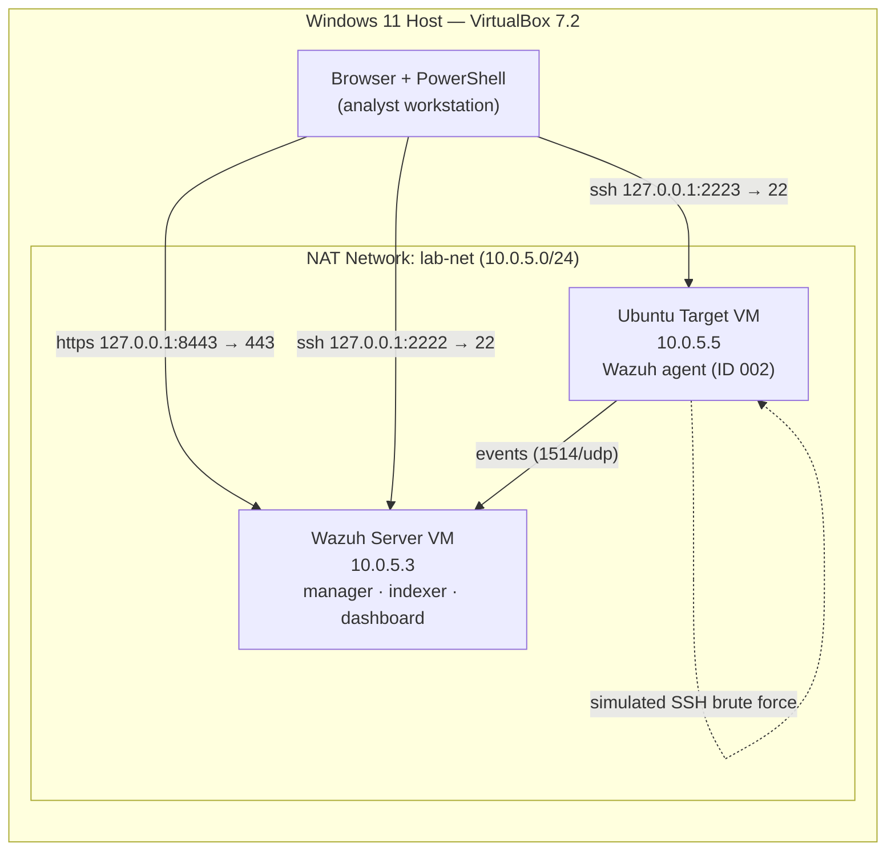

# Home SOC Lab — Wazuh SIEM Detection Engineering

A self-built security operations lab running the **Wazuh** open-source SIEM/XDR
platform. An endpoint is monitored with a Wazuh agent, attacks are generated
against it, and the resulting detections are analysed in the dashboard and mapped
to the **MITRE ATT&CK** framework and **PCI DSS** controls.

This repository documents the build, the detections, and the troubleshooting
involved in getting it working — the goal being to demonstrate hands-on SOC
analyst and detection-engineering skills, not just to follow a tutorial.

---

## Skills demonstrated

- Deploying and administering a SIEM (Wazuh 4.14.6 — manager, indexer, dashboard)
- Endpoint agent deployment and enrollment
- Virtual network design and segmentation (isolated NAT lab network)
- Attack simulation (SSH brute force)
- Log analysis and detection triage
- Mapping detections to **MITRE ATT&CK** and **PCI DSS**
- Linux administration, `systemd` service troubleshooting, secure-by-default hardening

---

## Lab architecture

| Component | Role | IP / Access |
|---|---|---|
| Wazuh Server (OVA, all-in-one) | SIEM manager, indexer, dashboard | `10.0.5.3` · dashboard `https://127.0.0.1:8443` |
| Ubuntu Target | Monitored endpoint, attack target | `10.0.5.5` · agent ID `002` |
| Lab network | Isolated NAT network | `lab-net` — `10.0.5.0/24`, DHCP |

---

## What's in this repo

| Path | Contents |
|---|---|
| [`setup/SETUP.md`](setup/SETUP.md) | Step-by-step build of the whole lab, reproducible from scratch |
| [`docs/architecture.md`](docs/architecture.md) | Design decisions and network layout |
| [`detections/ssh-brute-force.md`](detections/ssh-brute-force.md) | Flagship detection write-up: attack → alert → analysis |
| [`TROUBLESHOOTING.md`](TROUBLESHOOTING.md) | Real problems hit during the build and how they were resolved |
| [`screenshots/`](screenshots/) | Evidence (see the folder's README for what goes where) |

---

## Detection summary — SSH brute force

A password-based SSH brute force (8 failed logins) was launched against the Ubuntu
endpoint. Wazuh detected and classified it automatically:

| Detail | Value |
|---|---|
| Wazuh rules | **5710** (non-existent user), **5503** (PAM login failed), **2502** (repeated failures, level 10) |
| MITRE ATT&CK | **T1110 — Brute Force** (Credential Access) |
| PCI DSS | **10.2.4**, **10.2.5** |

Full write-up: [`detections/ssh-brute-force.md`](detections/ssh-brute-force.md).

---

## Roadmap

- [x] Phase 1 — Wazuh server, Ubuntu agent, SSH brute-force detection
- [ ] Phase 2 — Windows 11 endpoint + Sysmon, richer telemetry
- [ ] Phase 3 — Author a **custom detection rule** and decoder
- [ ] Phase 4 — File Integrity Monitoring (FIM) detection scenario
- [ ] Phase 5 — Simulate MITRE techniques with Atomic Red Team

---

## ⚠️ Note on credentials

No passwords, keys, or credential material are committed to this repository.
Default credentials were rotated during setup (see `TROUBLESHOOTING.md`).
All screenshots are redacted before being added.
