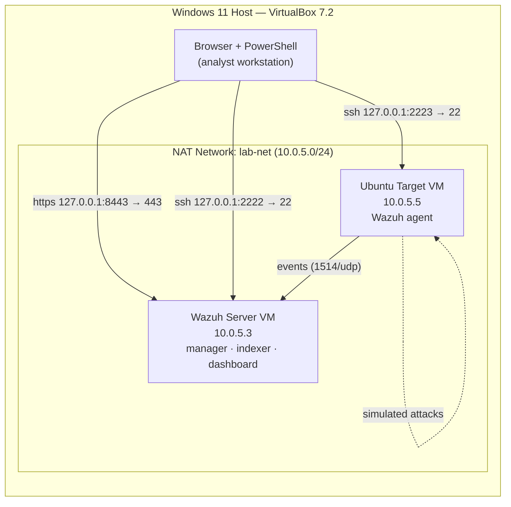

# Home SOC Lab — Wazuh SIEM Detection Engineering

A self-built security operations lab running the **Wazuh** open-source SIEM/XDR
platform. Endpoints are monitored with Wazuh agents, attacks are generated
against them, and the resulting detections are analysed in the dashboard and
mapped to the **MITRE ATT&CK** framework and **PCI DSS** controls — including a
**custom detection rule authored from scratch**.

This repository documents the build, the detections, and the troubleshooting
involved in getting it working — the goal being to demonstrate hands-on SOC
analyst and detection-engineering skills, not just to follow a tutorial.

---

## Skills demonstrated

- Deploying and administering a SIEM (Wazuh 4.14.6 — manager, indexer, dashboard)
- Endpoint agent deployment and enrollment
- Virtual network design and segmentation (isolated NAT lab network)
- Attack simulation (SSH brute force; SSH key persistence)
- **Authoring and validating a custom Wazuh detection rule**
- Configuring **File Integrity Monitoring (FIM)**
- Log analysis and detection triage
- Mapping detections to **MITRE ATT&CK** and **PCI DSS**
- Linux administration, `systemd` service troubleshooting, secure-by-default hardening

---

## Lab architecture

| Component | Role | IP / Access |
|---|---|---|
| Wazuh Server (OVA, all-in-one) | SIEM manager, indexer, dashboard | `10.0.5.3` · dashboard `https://127.0.0.1:8443` |
| Ubuntu Target | Monitored endpoint, attack target | `10.0.5.5` |
| Lab network | Isolated NAT network | `lab-net` — `10.0.5.0/24`, DHCP |

---

## What's in this repo

| Path | Contents |
|---|---|
| [`setup/SETUP.md`](setup/SETUP.md) | Step-by-step build of the whole lab, reproducible from scratch |
| [`docs/architecture.md`](docs/architecture.md) | Design decisions and network layout |
| [`detections/ssh-brute-force.md`](detections/ssh-brute-force.md) | Detection 1: SSH brute force (built-in rules, MITRE T1110) |
| [`detections/ssh-authorized-keys-persistence.md`](detections/ssh-authorized-keys-persistence.md) | Detection 2: **custom rule** for SSH key persistence (FIM, MITRE T1098.004) |
| [`TROUBLESHOOTING.md`](TROUBLESHOOTING.md) | Real problems hit during the build and how they were resolved |
| [`screenshots/`](screenshots/) | Evidence (see the folder's README for what goes where) |

---

## Detections

### 1 — SSH brute force

A password-based SSH brute force against the Ubuntu endpoint, detected and
classified automatically by Wazuh's built-in ruleset.

| Detail | Value |
|---|---|
| Wazuh rules | **5710** (non-existent user), **5503** (PAM login failed), **2502** (repeated failures, level 10) |
| MITRE ATT&CK | **T1110 — Brute Force** (Credential Access) |
| PCI DSS | **10.2.4**, **10.2.5** |

Full write-up: [`detections/ssh-brute-force.md`](detections/ssh-brute-force.md).

### 2 — SSH `authorized_keys` persistence (custom rule)

File Integrity Monitoring plus a **custom rule authored from scratch** that
escalates any change to an `authorized_keys` file into a high-severity,
MITRE-tagged persistence alert.

| Detail | Value |
|---|---|
| Custom rule | **100010** (level 12) |
| Detection source | Wazuh FIM (syscheck), real-time |
| MITRE ATT&CK | **T1098.004 — Account Manipulation: SSH Authorized Keys** (Persistence) |
| PCI DSS | **10.2.7** |

Full write-up: [`detections/ssh-authorized-keys-persistence.md`](detections/ssh-authorized-keys-persistence.md).

---

## Roadmap

- [x] Phase 1 — Wazuh server, Ubuntu agent, SSH brute-force detection
- [x] Phase 2 — File Integrity Monitoring + **custom detection rule** (SSH key persistence)
- [ ] Phase 3 — Windows endpoint + Sysmon, richer process/command-line telemetry
- [ ] Phase 4 — Wazuh active response (auto-block / isolate on detection)
- [ ] Phase 5 — Simulate MITRE techniques with Atomic Red Team

---

## ⚠️ Note on credentials

No passwords, keys, or credential material are committed to this repository.
Default credentials were rotated during setup (see `TROUBLESHOOTING.md`).
All screenshots are redacted before being added.
